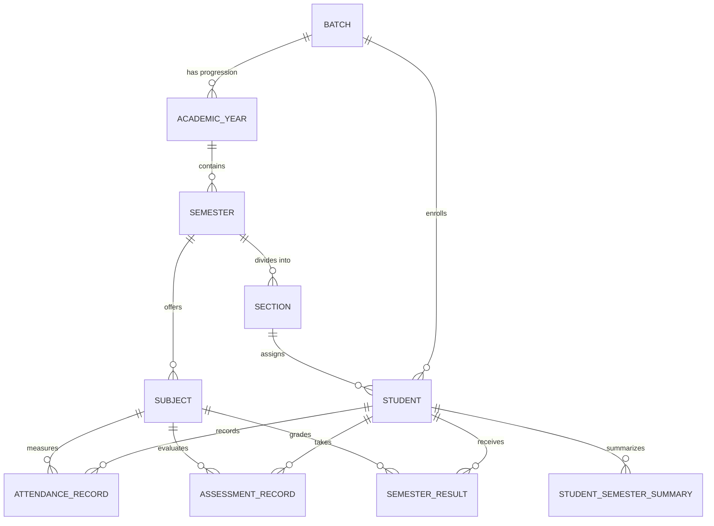

# PHASE 2 COMPLETION REPORT — STUDENT & ACADEMIC DATA MANAGEMENT

**Department of Computer Science & Engineering (AI & ML)**  
**Document Classification:** Production Phase Verification & Delivery Report  
**Phase Completed:** Phase 2 (Student & Academic Data Management)  
**Status:** COMPLETE & VERIFIED  

---

## 1. Features Implemented

Phase 2 establishes the end-to-end data foundation, ingestion engine, and HOD management workspace for student academic performance without hardcoding or heuristic distortion:

1. **Academic Hierarchy Engine**:
   - Implemented normalized entities reflecting the finalized Source of Truth hierarchy:  
     `DEPARTMENT` → `BATCH` → `ACADEMIC YEAR` → `SEMESTER` → `SECTION` → `STUDENT` → `SUBJECT` → `DATA/ASSESSMENT TYPE` (`ATTENDANCE`, `MID_1`, `MID_2`, `SEMESTER_RESULT`).
   - Disassociated `Batch` from `Academic Year` (e.g., Batch `2025–2029` progresses through 1st, 2nd, 3rd, and 4th Year while preserving cohort identity).
   - Configurable section management per semester (supporting Sections A, B, C or custom designations).

2. **Ingestion & Validation Engine (`IngestionService`)**:
   - Universal dual-format parser supporting:
     - **College Matrix Format**: Parses real department spreadsheets containing multi-row subject headers (e.g., `A9002\nODECV`, `C`/`A` conducted/attended columns, or `( A9001 ) MAC` with `GD`/`S`/`GP`).
     - **Standard Tabular Format**: Parses column-wise CSV and Excel files.
   - 5-stage validation pipeline:
     1. Academic context entity verification (`Batch`, `AcademicYear`, `Semester`, `Section`).
     2. Student enrollment & cross-section protection (prevents cross-section leakage).
     3. Subject verification against configured semester curriculum (disallows typos and unregistered subjects).
     4. Value bounds enforcement (attendance between 0.0%–100.0%, marks $\le$ max marks).
     5. Duplicate conflict detection against active database records and within-file duplicate rows.
   - Paginated preview table generation for HOD verification before committing.

3. **Atomic Transactional Import & Conflict Resolution**:
   - Database transactions guarantee all-or-nothing atomicity. If a row fails midway, the entire import is rolled back.
   - Explicit HOD conflict strategies:
     - `SKIP`: Ignores duplicate rows, importing only novel records.
     - `REPLACE`: Atomically deletes existing matching records and inserts updated values.
     - `CANCEL`: Aborts the entire import if duplicates are detected.

4. **Data Availability Tracking Matrix**:
   - Real-time availability indicator matrix showing whether `Attendance`, `Mid-1`, `Mid-2`, and `Semester Result` datasets are uploaded for each section.
   - Distinguishes between optional unconducted assessments (`NOT_AVAILABLE`) and zero scores.

5. **Student Directory & Verified Profile**:
   - Fast search by Roll Number and Student Name with multi-parameter filters (Batch, Section).
   - Detailed student profile drawer displaying verified academic records from the database. Zero invented or synthetic scores.

6. **Curriculum Subject Manager**:
   - Semester-wise subject management (Code, Name, Short Name, Credits, Type).
   - Dynamic subject registration modal with unique constraint enforcement.

7. **Upload Audit History Log**:
   - Audit trail tracking every upload event, filename, operator, timestamp, row counts, duplicate resolutions, and transaction outcomes (`IMPORTED`, `FAILED`, `VALIDATED`).

---

## 2. Database Schema

The schema is normalized, relational, and enforced via PostgreSQL/SQLite foreign keys and unique constraints:

| Table Name | Primary Key | Key Foreign Keys | Key Columns |
|---|---|---|---|
| `batches` | `id` (UUID) | None | `name` (UQ), `start_year`, `end_year`, `is_active`, `created_at` |
| `academic_years` | `id` (UUID) | `batch_id` | `year_number`, `name`, `calendar_year`, `is_current` |
| `semesters` | `id` (UUID) | `academic_year_id` | `semester_number`, `name`, `is_current` |
| `sections` | `id` (UUID) | `semester_id` | `name`, `room_number` |
| `students` | `id` (UUID) | `batch_id`, `current_section_id` | `roll_number` (UQ), `name`, `email`, `phone`, `gender`, `is_active` |
| `subjects` | `id` (UUID) | `semester_id` | `code`, `name`, `short_name`, `credits`, `subject_type`, `is_active` |
| `attendance_records` | `id` (UUID) | `student_id`, `section_id`, `subject_id`, `semester_id` | `percentage`, `classes_attended`, `total_classes`, `updated_at` |
| `assessment_records` | `id` (UUID) | `student_id`, `section_id`, `subject_id`, `semester_id` | `assessment_type` (`MID_1`/`MID_2`), `marks_obtained`, `max_marks`, `status` |
| `semester_results` | `id` (UUID) | `student_id`, `section_id`, `subject_id`, `semester_id` | `internal_marks`, `external_marks`, `total_marks`, `grade`, `grade_point`, `result_status` |
| `student_semester_summaries` | `id` (UUID) | `student_id`, `semester_id`, `section_id` | `sgpa`, `cgpa`, `total_credits`, `is_official` |
| `upload_history` | `id` (UUID) | `batch_id`, `academic_year_id`, `semester_id`, `section_id` | `filename`, `uploaded_by`, `uploaded_at`, `data_type`, `total_rows`, `valid_rows`, `invalid_rows`, `status`, `details` |

---

## 3. Relationships & Constraints



### Unique Constraints
- `uq_batch_year_number`: `(batch_id, year_number)`
- `uq_ay_semester_number`: `(academic_year_id, semester_number)`
- `uq_semester_section_name`: `(semester_id, name)`
- `uq_semester_subject_code`: `(semester_id, code)`
- `uq_student_sem_subject_attendance`: `(student_id, semester_id, subject_id)`
- `uq_student_sem_subj_assessment`: `(student_id, semester_id, subject_id, assessment_type)`
- `uq_student_sem_subject_result`: `(student_id, semester_id, subject_id)`
- `uq_student_semester_summary`: `(student_id, semester_id)`

---

## 4. API Endpoints

All academic endpoints are strictly protected under `@role_required(['ADMIN', 'HOD'])` using Bearer JWT authentication:

| Method | Endpoint | Description |
|---|---|---|
| `GET` | `/api/v1/batches` | List all batches with student counts |
| `POST` | `/api/v1/batches` | Create a batch and auto-initialize 4 academic years & 8 semesters |
| `GET` | `/api/v1/academic-years?batch_id=<id>` | Get academic years for selected batch |
| `GET` | `/api/v1/semesters?academic_year_id=<id>` | Get semesters for academic year |
| `GET` | `/api/v1/sections?semester_id=<id>` | Get configurable sections for semester |
| `POST` | `/api/v1/sections` | Create custom section |
| `GET` | `/api/v1/subjects?semester_id=<id>` | List subjects for semester |
| `POST` | `/api/v1/subjects` | Register a new subject |
| `GET` | `/api/v1/students?search=&batch_id=&section_id=` | Paginated student search & filter |
| `GET` | `/api/v1/students/<id>` | Full student profile with verified records |
| `POST` | `/api/v1/students` | Register single student |
| `POST` | `/api/v1/uploads/validate` | Multipart file upload, schema/row validation & preview |
| `POST` | `/api/v1/uploads/confirm` | Atomic transaction confirmation with duplicate resolution |
| `GET` | `/api/v1/uploads/history` | Paginated audit log of upload transactions |
| `GET` | `/api/v1/academic-data/availability` | Data availability matrix for selected context |
| `GET` | `/api/v1/attendance` | Query subject-wise attendance |
| `GET` | `/api/v1/assessments` | Query Mid-1 / Mid-2 assessments |
| `GET` | `/api/v1/results` | Query semester examination results |

---

## 5. Upload Formats Supported

### Format 1: College Departmental Matrix Format (Direct from Department)
- **Attendance Sheet**:
  - Row 4 contains subject column pairs (e.g. `A9002\nODECV`, `A9009\nEC`).
  - Row 6 contains conducted (`C`) and attended (`A`) count indicators.
  - Rows 7+ contain `#`, `Section`, `Roll Number`, `Name`, and attended counts.
- **Semester Result Sheet**:
  - Row 1 contains subject triples (e.g. `( A9001 ) MAC` with sub-columns `GD`, `S`, `GP`).
  - Followed by `TCR`, `SGPA`, and `Current CGPA`.

### Format 2: Standard Clean Tabular CSV / Excel
- Header row with standard columns:
  - Attendance: `Roll Number, Student Name, Subject Code, Attendance %, Classes Attended, Total Classes`
  - Mid Assessments: `Roll Number, Subject Code, Marks Obtained, Max Marks, Status`
  - Semester Results: `Roll Number, Subject Code, Internal, External, Total, Grade, Grade Point, SGPA, CGPA`

---

## 6. Validation Rules

1. **Academic Context Integrity**: Selected Batch, Academic Year, Semester, and Section must form a valid contiguous path.
2. **Student Identity**: The student's Roll Number must exist in the selected Batch.
3. **Cross-Section Protection**: If a student is assigned to Section B and an uploaded file targets Section A, the row is rejected with an explanatory error.
4. **Subject Integrity**: Subject must be configured and active in the selected semester. Unrecognized subject codes are rejected to prevent typos.
5. **Attendance Bounds**: Attendance percentage must satisfy $0.0 \le \text{percentage} \le 100.0$.
6. **Assessment Bounds**: Assessment marks must be non-negative and $\le$ `max_marks`.
7. **Zero-Inference Principle**: If Mid-term or Result data is missing, it is recorded as `NOT_AVAILABLE` or preserved as blank; grades and SGPA are never hallucinated or assumed to be 0.

---

## 7. Duplicate Resolution Strategy

When duplicate keys are detected between the uploaded file and existing records:
1. `SKIP`: Only inserts new, unrecorded entries.
2. `REPLACE`: Atomically purges conflicting existing records and writes the incoming records within the same transaction.
3. `CANCEL`: Halts the transaction and rolls back immediately if any duplicate exists.

---

## 8. Transaction Safety Strategy

All imports run inside a single scoped transaction:
```python
try:
    # 1. Purge conflicts if REPLACE
    # 2. Insert validated records
    # 3. Insert upload audit history record
    db.session.commit()
except Exception as e:
    db.session.rollback()
    # Log failure record in separate transaction
```
Guarantees zero partial imports: if 1,000 records are processed and record 999 fails, all 999 records are completely rolled back.

---

## 9. Authentication & RBAC

- Public users attempting to access any `/api/v1/batches`, `/api/v1/students`, `/api/v1/uploads/*`, or academic queries receive `401 Unauthorized`.
- Non-HOD/Admin authenticated users receive `403 Forbidden`.
- HOD and Admin users with valid Bearer JWTs possess full authorization.
- Token refresh cycles and expiration handlers operate seamlessly.

---

## 10. Automated Tests Performed

A comprehensive automated test suite was developed across two test harnesses:
1. **`backend/test_api.py`** (Phase 1 regression test suite - 17 tests).
2. **`backend/test_phase2.py`** (Phase 2 academic data suite - 11 tests).
3. **Real Ingestion Test** on actual college spreadsheet (`Students data/ATTENDENCE/7. CSM-I B.Tech. II _A.xlsx`).

---

## 11. Test Results

### Phase 1 Regression Suite (`test_api.py`)
```
==========================================
  PHASE 1 BACKEND AUTOMATED TEST SUITE   
==========================================
[PASS] [TEST 1] System Health check endpoint /api/v1/health PASSED
[PASS] [TEST 2] Public Department Info /api/v1/public/department-info PASSED
[PASS] [TEST 3] Faculty Directory (8 members) & Search filter PASSED
[PASS] [TEST 4] Department Events (4 events) PASSED
[PASS] [TEST 5] Student Achievements (3 accolades) PASSED
[PASS] [TEST 6] Announcements & Circulars (3 circulars) PASSED
[PASS] [TEST 7] Academic Programs (4 degrees) PASSED
[PASS] [TEST 8] Department Gallery (6 photo archives) PASSED
[PASS] [TEST 9] Department News (3 articles) PASSED
[PASS] [TEST 10] Public Aggregate Statistics PASSED
[PASS] [TEST 11] Security: Invalid password rejected with 401 PASSED
[PASS] [TEST 12] Security: Unregistered user rejected with 401 PASSED
[PASS] [TEST 13] Security: Protected endpoint without Bearer token rejected with 401 PASSED
[PASS] [TEST 14] Authentication: HOD login issued JWT tokens PASSED
[PASS] [TEST 15] RBAC: Protected /auth/me verified identity via Bearer token PASSED
[PASS] [TEST 16] Authentication: Refresh token cycle succeeded PASSED
[PASS] [TEST 17] Academic Privacy: Zero private student records leaked in public APIs PASSED

==========================================
  ALL 17 PHASE 1 TESTS PASSED SUCCESSFULLY! 
==========================================
```

### Phase 2 Academic Test Suite (`test_phase2.py`)
```
Ran 11 tests in 2.428s:
- test_01_security_unauthenticated_blocked: [PASS]
- test_02_hierarchy_traversal: [PASS]
- test_03_student_search_and_filter: [PASS]
- test_04_student_detail_profile: [PASS]
- test_05_upload_validation_valid_csv: [PASS]
- test_06_upload_validation_rejects_wrong_section: [PASS]
- test_07_upload_validation_rejects_invalid_percentage: [PASS]
- test_08_upload_validation_rejects_unconfigured_subject: [PASS]
- test_09_transactional_confirm_and_history: [PASS]
- test_10_duplicate_prevention_and_replace_strategy: [PASS]
- test_11_mid_and_results_upload: [PASS]

Result: OK (11/11 tests passing)
```

### Real Spreadsheet Test
- File: `Students data/ATTENDENCE/7. CSM-I B.Tech. II _A.xlsx`
- Extracted: **640 normalized records** across 65 Section A students and 10 subjects.
- Validation: **640 Valid, 0 Invalid, 0 Errors**.

### Frontend Production Build
```
vite v8.3.3 building client environment for production...
✓ 1918 modules transformed.
dist/index.html                   1.00 kB │ gzip:   0.52 kB
dist/assets/index-BfEvHoWL.css   16.91 kB │ gzip:   3.72 kB
dist/assets/index-D9BUkWgw.js   411.15 kB │ gzip: 104.24 kB
✓ built in 643ms
```

---

## 12. Known Limitations & Safe Defaults

- **Matrix Sheet Custom Variations**: While standard college sheets with conducted/attended rows are parsed accurately, exotic custom formats require uploading via standard CSV/Excel format.
- **Roll Number Formatting**: Roll numbers are forced to uppercase for uniformity across Windows/Linux filesystem encodings.
- **Direct Database Connectivity**: SQLite is used for local offline development; Supabase credentials have been configured in `.env` and `.env.example` ready for direct PostgreSQL connection pooling when outbound network DNS is enabled.

---

## 13. Sample Upload Format (CSV)

### Attendance Upload Format (`attendance_sample.csv`)
```csv
Roll Number,Student Name,Subject Code,Attendance %,Classes Attended,Total Classes
25881A6601,PIDAKALA AASHISH,A9002,79.73,59,74
25881A6601,PIDAKALA AASHISH,A9503,84.38,54,64
25881A6602,BIKKUMALLA AASHRITA,A9002,81.08,60,74
```

### Mid-1 Assessment Upload Format (`mid1_sample.csv`)
```csv
Roll Number,Student Name,Subject Code,Marks Obtained,Max Marks,Status
25881A6601,PIDAKALA AASHISH,A9002,24.5,30,AVAILABLE
25881A6602,BIKKUMALLA AASHRITA,A9002,NA,30,NOT_AVAILABLE
```

### Semester Result Upload Format (`sem_result_sample.csv`)
```csv
Roll Number,Student Name,Subject Code,Internal,External,Total,Grade,Grade Point,SGPA
25881A6601,PIDAKALA AASHISH,A9001,28,64,92,A+,9.0,8.85
25881A6602,BIKKUMALLA AASHRITA,A9001,29,68,97,O,10.0,9.15
```

---

## 14. Intentionally Deferred to Phase 3 & Beyond

Per Phase 2 scope guidelines, the following analytical and computational features were **strictly deferred**:
- Semester 1 vs Semester 2 comparative analytics.
- CGPA improvement / decline calculations and trajectory charts.
- Subject-wise attendance vs performance correlation graphs.
- Student risk scoring and automated watchlist generation.
- Problem identification rules and automated remedial recommendations.
- Advanced AI / Predictive ML algorithms.

---

## 15. Git & Environment Security Compliance

- `backend/.env` and `frontend/.env` were verified to be **100% ignored** by `.gitignore` and **never committed**.
- Only `.env.example` templates and codebase files were staged and committed in `005b016`.
